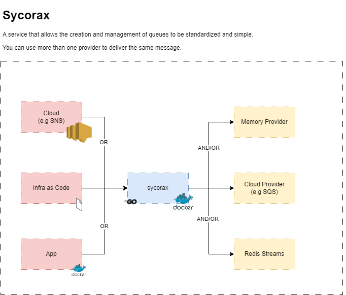

# Sycorax

A service that allows the creation and management of queues to be standardized and simple. You can use more than one provider to deliver the same message.

Overview:

- [About](#sycorax)
- [System design (Architecture)](#system-design-architecture)
- [Contributing](#contributing)
- [Style Guide](#style-guide)
- [Docs](#docs)

---

## System design (Architecture)



---

## Contributing

`TBD.`

---

## Style Guide

`TBD.`

---

## Docs (Swagger, AsyncAPI, Decisions history)

Our service documentation is centered around a swagger (rest) and async-api (events)

```
/docs              # Index page
/docs/rest-api     # The rendered OpenAPI spec for the sync/async endpoints
/docs/async-api    # The rendered AsyncAPI spec for the queues and topics
```

Details of business rules and definitions:

`TBD.`
